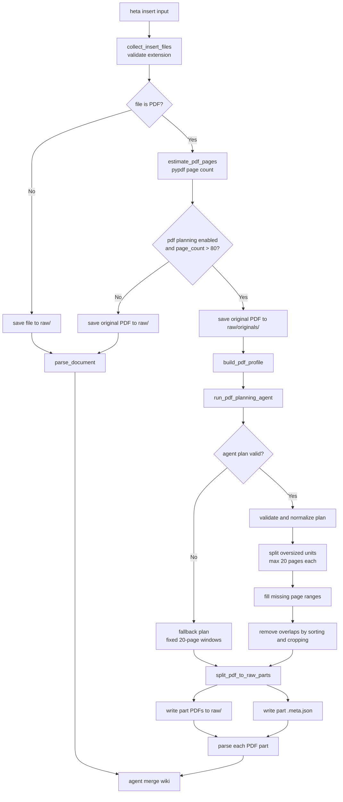
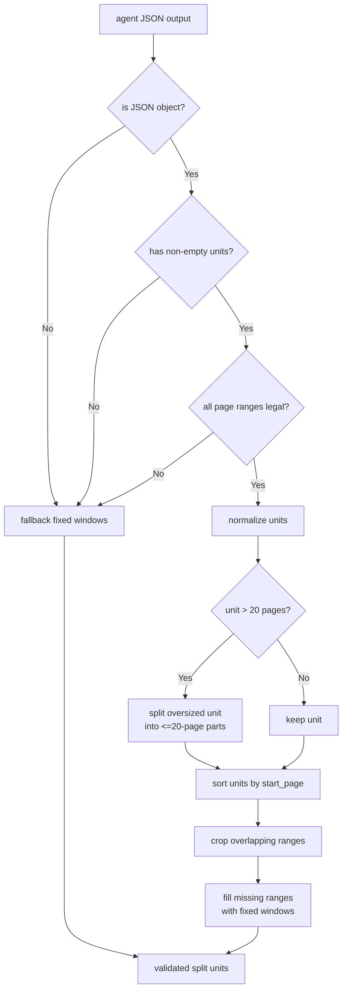

# PDF Planning Agent Flow

This document describes the Little Heta large-PDF planning flow used by `heta insert`.

The goal is to avoid sending an entire large PDF directly into parsing and wiki merge. Little Heta first builds a lightweight PDF profile, asks a planning agent how to split the document, validates the plan, and then performs deterministic PDF splitting in code.

## High-Level Flow



## Agent Input

The planning agent does not read the full PDF. It receives a lightweight `PdfProfile`.

```json
{
  "filename": "large-report.pdf",
  "page_count": 200,
  "metadata": {
    "Title": "Example Report",
    "Author": "Example Author"
  },
  "outline": [
    {
      "title": "Chapter 1 Introduction",
      "page": 1,
      "depth": 0
    }
  ],
  "page_samples": [
    {
      "page": 1,
      "text": "sampled text from page 1..."
    },
    {
      "page": 26,
      "text": "sampled text from page 26..."
    }
  ],
  "heading_candidates": [
    {
      "page": 1,
      "text": "Chapter 1 Introduction"
    }
  ]
}
```

Plain-language meaning:

- `filename`: The PDF file name.
- `page_count`: Total number of pages.
- `metadata`: PDF metadata such as title, author, and subject.
- `outline`: Built-in PDF bookmarks or outline entries, if present.
- `page_samples`: Extracted text from selected sample pages.
- `heading_candidates`: Heading-like lines detected from sampled text.

Sampling policy:

- First four pages.
- Every `page_count // 8` pages.
- Last page.
- Each sampled page is truncated to about 900 characters.
- The final profile sent to the agent is capped at about 12,000 characters.

## Agent Output

The planning agent must return JSON only.

```json
{
  "document_type": "textbook",
  "split_strategy": "chapter",
  "units": [
    {
      "title": "Chapter 1: Introduction",
      "start_page": 1,
      "end_page": 32
    },
    {
      "title": "Chapter 2: Methods",
      "start_page": 33,
      "end_page": 78
    }
  ]
}
```

Plain-language meaning:

- `document_type`: The agent's best guess of the PDF type.
  - `textbook`
  - `paper_collection`
  - `report`
  - `slides`
  - `manual`
  - `scanned_book`
  - `mixed`
- `split_strategy`: How the agent thinks the PDF should be split.
  - `outline`
  - `chapter`
  - `section`
  - `fixed_page_window`
  - `fallback`
- `units`: The proposed page ranges. Page numbers are 1-based and inclusive.

## Validation Logic

The agent output is never trusted directly. Little Heta validates and normalizes the plan before splitting.



Validation rules:

- The output must be parseable JSON.
- The JSON must be an object.
- `units` must exist and must not be empty.
- Each unit must satisfy:
  - `start_page >= 1`
  - `end_page <= page_count`
  - `start_page <= end_page`
- Oversized units are split into smaller parts.
- Missing page ranges are filled automatically.
- Overlapping ranges are cropped after sorting.
- If the plan is invalid, Little Heta falls back to fixed 20-page windows.

## Split Output

For a large PDF, Little Heta stores:

```text
raw/
  originals/
    2026-05-13_143000_big-book.pdf

  2026-05-13_143000_big-book_part-001_intro_pages-1-20.pdf
  2026-05-13_143000_big-book_part-001_intro_pages-1-20.meta.json
  2026-05-13_143000_big-book_part-002_methods_pages-21-40.pdf
  2026-05-13_143000_big-book_part-002_methods_pages-21-40.meta.json
```

Each `.meta.json` records traceability:

```json
{
  "original": "raw/originals/2026-05-13_143000_big-book.pdf",
  "part": "raw/2026-05-13_143000_big-book_part-001_intro_pages-1-20.pdf",
  "title": "Introduction",
  "start_page": 1,
  "end_page": 20,
  "document_type": "report",
  "split_strategy": "section"
}
```

## Fallback Behavior

Fallback is intentionally simple and deterministic:

```text
Pages 1-20
Pages 21-40
Pages 41-60
...
```

Fallback is used when:

- The planning agent fails.
- The agent returns non-JSON text.
- The JSON shape is invalid.
- Page ranges are illegal.
- `units` is empty.
- No LLM config is provided to the planning function.

## Design Boundary

The planning agent only decides how the PDF should be split. It does not parse the full PDF, edit wiki pages, create markdown pages, or write files.

The deterministic code owns:

- PDF page counting.
- Profile generation.
- Plan validation.
- Missing page recovery.
- Oversized unit splitting.
- Actual PDF splitting.
- Raw file and metadata writing.

