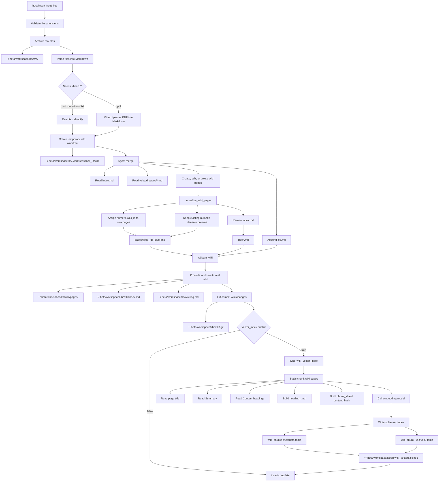

# HetaWiki Backend Flow

This document records the current Little Heta backend flow for `heta insert`,
HetaWiki page identity, and the optional sqlite-vec vector index.

## Flow



## Main Entities

### Config

Path:

```text
~/.heta/heta.yaml
```

Relevant fields:

```yaml
llm:
  provider: qwen
  api_key: ...
mineru:
  enable: true
  provider: cloud
vector_index:
  enable: true
```

`vector_index.enable` controls whether `heta insert` syncs sqlite-vec after a
successful wiki commit.

CLI controls:

```bash
heta vector status
heta vector on
heta vector off
```

### Raw Files

Path:

```text
~/.heta/workspace/kb/raw/
```

Stores uploaded source files after extension validation.

### Temporary Worktree

Path:

```text
~/.heta/workspace/kb/.worktrees/task_id/wiki/
```

The agent edits this copy first. Partial or failed inserts can be cleaned up
without corrupting the real wiki.

### Real Wiki

Path:

```text
~/.heta/workspace/kb/wiki/
```

Important files:

```text
wiki/index.md
wiki/log.md
wiki/pages/{wiki_id}-{slug}.md
wiki/.git/
```

Page identity is file-based. The numeric prefix is the `wiki_id`:

```text
pages/1-heta-是什么.md
pages/2-hetagen.md
pages/3-王铎.md
```

New pages get `max(existing wiki_id) + 1`. Deleted ids are not reused.

`index.md` stores page id, title, path, and summary:

```md
- [2] [[HetaGen]] (pages/2-hetagen.md) — HetaGen is Heta's knowledge-base-driven structured content generation layer.
```

Wiki links inside page bodies stay semantic and do not include ids:

```md
[[HetaGen]]
[[王铎]]
```

### Agent Responsibilities

The agent handles semantic wiki editing:

- Read `index.md`.
- Read related `pages/*.md`.
- Decide whether to create, edit, or delete pages.
- Maintain semantic `[[Wiki Links]]`.
- Append `log.md`.

The agent does not own:

- `wiki_id`
- numeric filename prefixes
- `chunk_id`
- vector database consistency

Those are maintained by code after the agent finishes.

### Normalize Step

`normalize_wiki_pages` runs after agent merge and before validation.

It:

- Assigns a numeric prefix to new pages.
- Keeps existing numeric prefixes.
- Rewrites `index.md` into the canonical `[id] [[Title]] (path) — summary` format.

It is a normalization layer, not a strict validation layer.

### Vector Database

Path:

```text
~/.heta/workspace/kb/db/wiki_vectors.sqlite3
```

Tables:

```sql
CREATE TABLE wiki_chunks (
  id INTEGER PRIMARY KEY,
  wiki_id INTEGER NOT NULL,
  page_name TEXT NOT NULL,
  chunk_id TEXT NOT NULL UNIQUE,
  heading_path TEXT NOT NULL,
  content TEXT NOT NULL,
  content_hash TEXT NOT NULL,
  updated_at TEXT NOT NULL DEFAULT CURRENT_TIMESTAMP
);

CREATE VIRTUAL TABLE wiki_chunk_vec USING vec0(
  embedding FLOAT[1024]
);
```

`wiki_chunks.id` and `wiki_chunk_vec.rowid` are aligned.

Chunk content is generated from the Markdown page:

```text
Page: HetaGen
Summary: ...
Section: Content > Table Synthesis and Text-to-SQL > Submit a task

...
```

`heading_path` is parsed from Markdown headings under `## Content`. If headings
are missing, the fallback section is `Content`.

## Insert Failure Semantics

The wiki remains the source of truth.

If vector sync fails after a successful wiki commit, `heta insert` still
completes. The vector index can be rebuilt from the wiki later.
